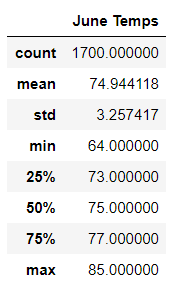
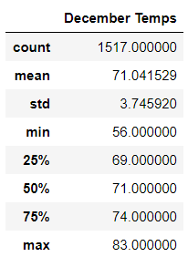
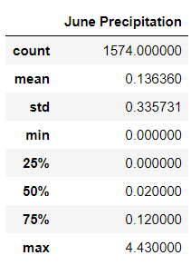
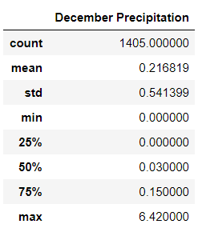

# Surfs_Up

## Project Overview

The following analysis was performed to provide statistics regarding temperature data for the months of June and December in Oahu, Hawaii to help determine if the Surf & Ice Cream shop business is sustainable year-round.

## Resources 

- Software: Anaconda 4.9.2, Jupyter Notebook 6.1.4, Python 3.8.5
- Data Sources: [SurfsUp_Challenge](SurfsUp_Challnege.ipynb)
  

## Results

#### 1. June Temperature

The following statistics can be determined based on **1,700** recorded temperatures for the month of June:

- The average temperature for June is approximately **75°F**
- There has been high of **85°F** 
- There has been a low **64°F**

  

#### 2. December Temperature

The following statistics can be determined based on **1,517** recorded temperatures for the month of December:

- The average temperature for June is approximately **71°F**
- There has been high of **83°F** 
- There has been a low **56°F**

  

## Summary

Based on the results, we can determine that the temperature in Oahu is roughly the same during the months of June and December. Despite December experiencing low temperatures of 56°F, both months have experienced temperature highs in the mid 80's range which would allow sustainable year-round business for the Surf & Ice Cream shop.

**Additional Queries For Analysis:**
 
 
 

